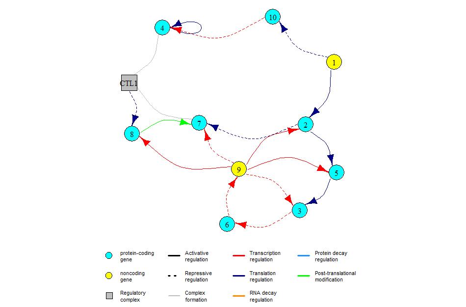
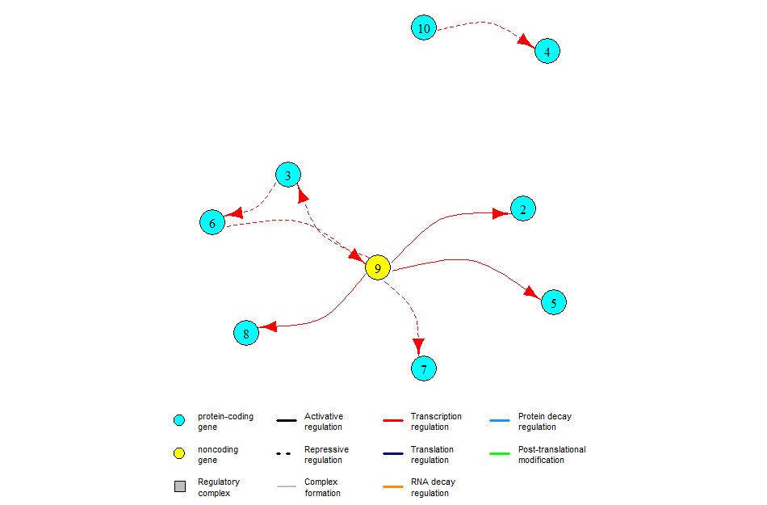
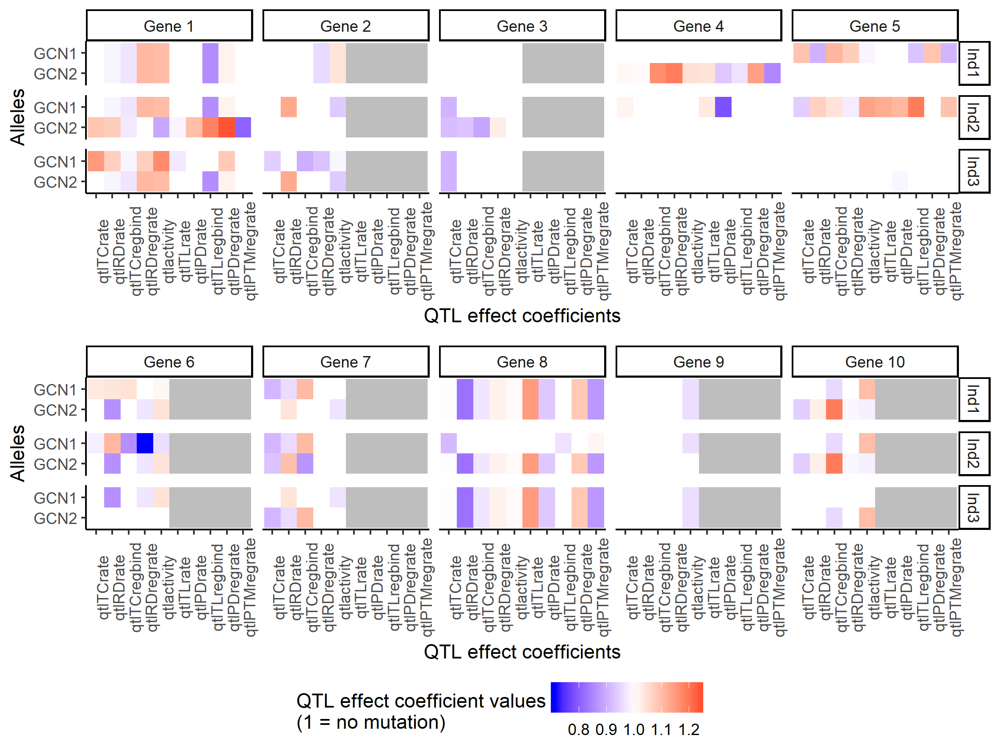
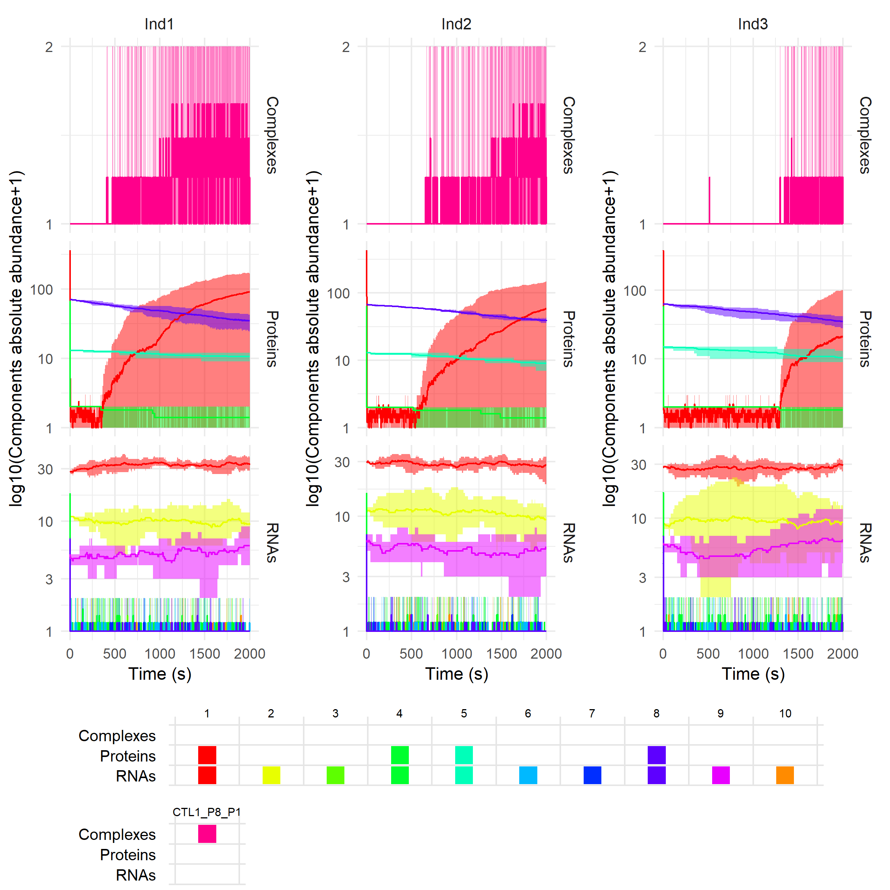
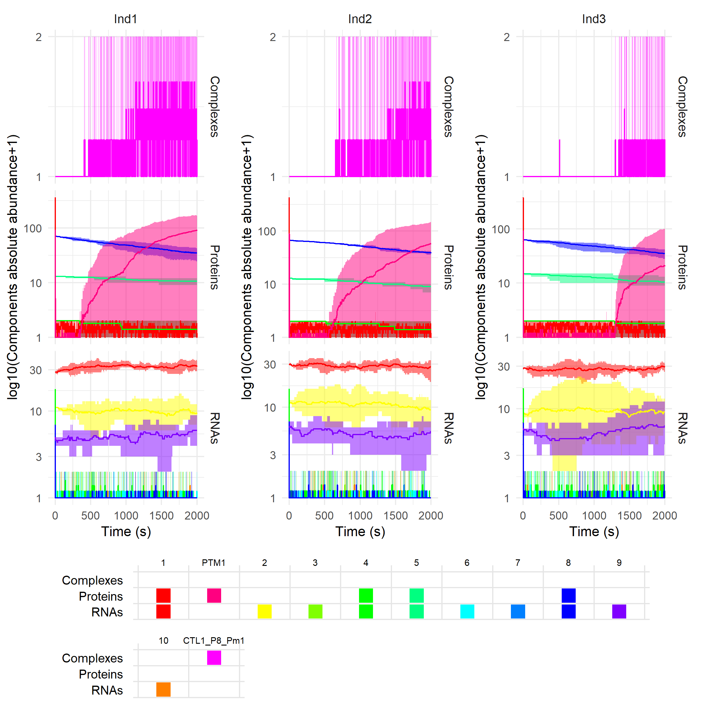
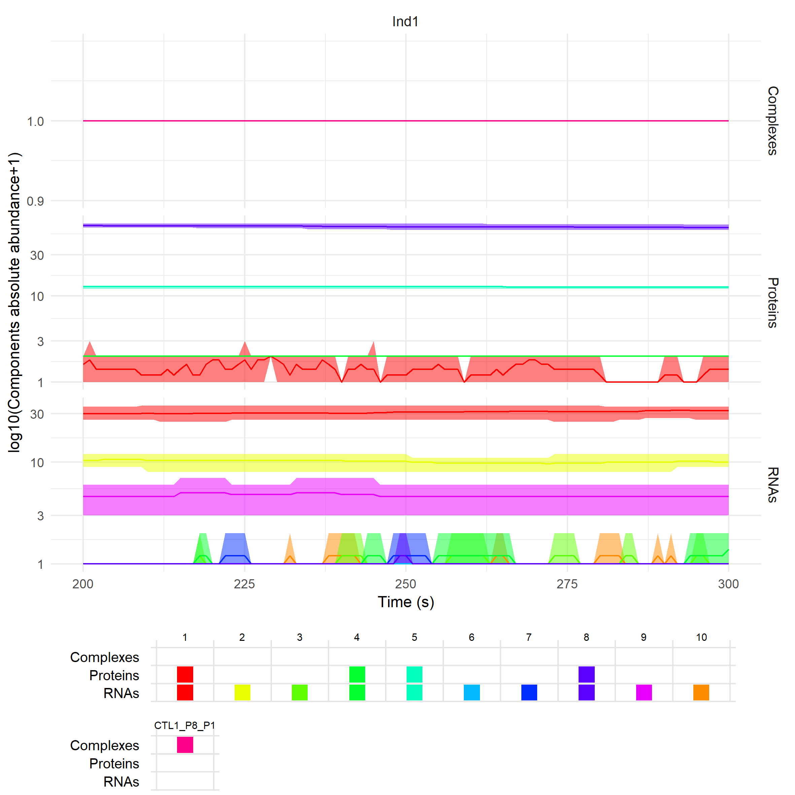
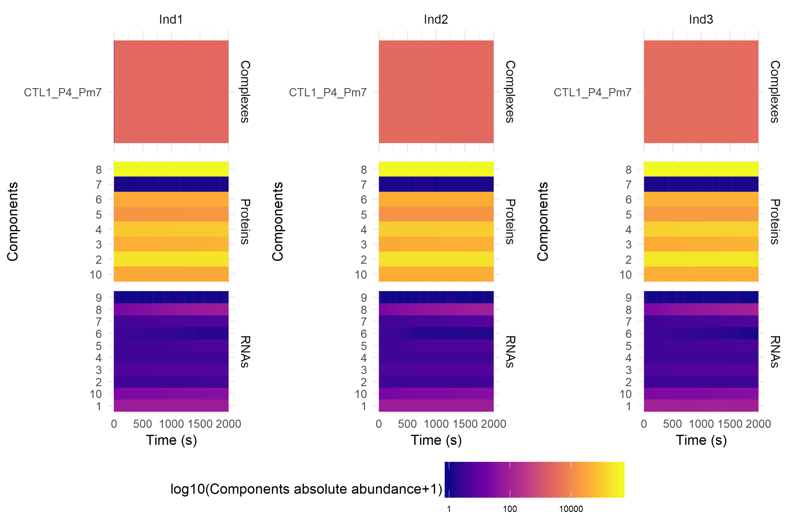
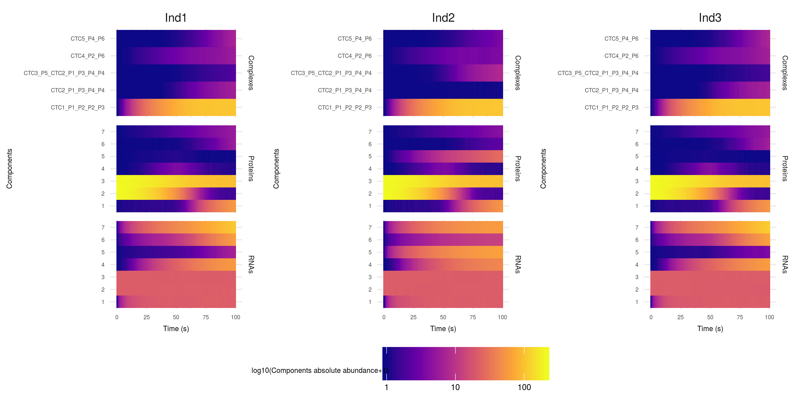
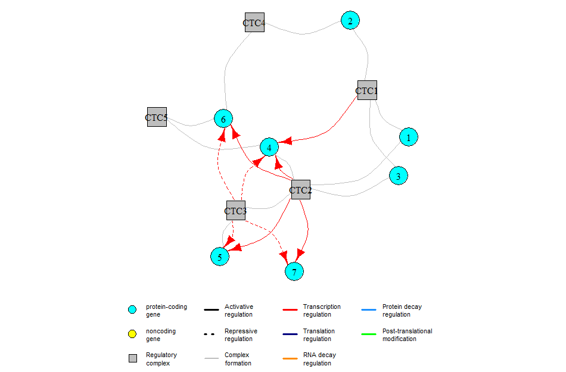

*An R package for generating and simulating in silico biological systems.*

* TOC
{:toc}

# Introduction

The sismonr package aims at simulating random *in silico* biological systems, containing genes linked through networks of regulatory interactions. The regulatory interactions can be of different type, i.e. we account for regulation of transcription, translation, RNA decay, protein decay and protein post-translational modification. sismonr then simulates the stochastic expression profiles of the different genes in these systems over time for different *in silico* individuals, where the individuals are distinguised by the genetic mutations they carry for each gene, affecting the properties of the genes. The user has control over the different parameters used in the generation of the genes, the regulatory network and the individuals.

Here we describe how to use the sismonr package. The code used throughout this documentation as well as the created variables saved as `.RData` objects are available [here](https://github.com/oliviaAB/sismonr/tree/master/docs/example).

## Abbreviations

Here are the notations used throughout the sismonr package:

| Abbreviations | Meaning |
| ------------- | ------- |
| TC | Transcription |
| TL | Translation |
| RD | RNA decay |
| PD | Protein decay |
| PTM | Post-translational modification |
| | | 
| PC | Protein-coding |
| NC | Noncoding |
| | |
| Pr | Promoter binding site |
| RBS | RNA binding site |
| R | RNA |
| P | Protein |
| Pm | Modified protein |
| C | Regulatory complex | 


# Creating an *in silico* system

The first step is to generate an *in silico* system. An *in silico* system is composed of a set of genes, and a gene regulatory network or GRN describing the different regulatory interactions occuring between the genes. The system is created by a call to the function `createInSilicoSystem`. The user can control different aspects of the system with the arguments passed to the function. For example:
```r
mysystem = createInSilicoSystem(G = 10, PC.p = 0.7)
```
generates an *in silico* system with 10 genes, and during the generation process each gene has a probability of 0.7 to be a protein-coding gene (as opposed to noncoding gene). The system returned by the function is an object of class `insilicosystem`, i.e. a list whose different attributes are presented below.

## The list of genes

The different genes constituting the system are stored in a data-frame, and can be accessed with:
```r
> mysystem$genes

   id coding TargetReaction PTMform ActiveForm       TCrate      TLrate       RDrate       PDrate
1   1     PC             TL       1        Pm1 0.0102159120 0.004676446 0.0007152649 0.0003305674
2   2     NC             RD       0         R2 0.0031143833 0.000000000 0.0006921874 0.0000000000
3   3     NC             TC       0         R3 0.0025507259 0.000000000 0.0010819792 0.0000000000
4   4     PC             PD       0         P4 0.0066864265 0.002069481 0.0008937198 0.0005002953
5   5     PC             RD       0         P5 0.0007279451 0.001170024 0.0009666276 0.0001403540
6   6     NC             RD       0         R6 0.0026713041 0.000000000 0.0025745269 0.0000000000
7   7     NC             RD       0         R7 0.0007240740 0.000000000 0.0004825935 0.0000000000
8   8     PC             TL       0         P8 0.0018790099 0.003752991 0.0006427814 0.0003395985
9   9     NC            PTM       0         R9 0.0020533039 0.000000000 0.0008391371 0.0000000000
10 10     NC             TL       0        R10 0.0026228109 0.000000000 0.0015883781 0.0000000000
```

Each gene is labeled with an ID (column `id`) and possesses the following parameters:

- `coding`: gives the **coding status** of the gene, i.e. describes if the gene is protein-coding (`coding = "PC"`) or noncoding (`coding = "NC"`);
- `TargetReaction`: describes the biological function of the gene, i.e. the type of regulation that it performs on its targets. This parameter can take one of the following values:
  - `"TC"`: regulator of transcription
  - `"TL"`: regulator of translation
  - `"RD"`: regulator of RNA decay
  - `"PD"`: regulator of protein decay
  - `"PTM"`: regulator of protein post-translational modification
  - `"MR"`: metabolic enzyme (only for protein-coding genes, indicates that the gene cannot regulate the expression of another gene);
- `PTMform`: does the protein of the gene has a (post-translationally) modified form? Will always be `"0"` for noncoding genes;
- `ActiveForm`: what is the active form of the gene? If the gene is noncoding, then `ActiveForm` is set to `"R[gene ID]"` (e.g. `R1` for gene 1), and for a protein-coding gene `ActiveForm = "P[gene ID]"`. If the protein of a protein-coding gene is targeted for post-translational modification (`PTMform = "1"`) then we assume that only the modified form of the protein is active, and thus `ActiveForm = Pm[gene ID]`;
- `TCrate`, `TLrate`, `RDrate` and `PDrate`: give the transcription (in RNA.s$$^{-1}$$), translation (in protein.RNA$$^{-1}$$.s$$^{-1}$$), RNA decay and protein decay (in s$$^{-1}$$) rates of the genes, respectively. `TLrate` and `PDrate` are set to 0 for noncoding genes.

## The Gene Regulatory Network

The regulatory network describing the regulatory interactions between the genes are stored in a data-frame, and accessible with:
```r
> mysystem$edg

   from to TargetReaction RegSign RegBy
1     3  1             TC       1    NC
2     3  2             TC       1    NC
3     3  5             TC      -1    NC
4     3  6             TC       1    NC
5     3  7             TC       1    NC
6     3  8             TC      -1    NC
7     3  9             TC      -1    NC
8    10  1             TL       1    NC
9  CTL1  5             TL       1     C
10   10  8             TL      -1    NC
11    5 10             RD       1    PC
12    2 10             RD       1    NC
13    6 10             RD       1    NC
14    2  3             RD       1    NC
15    7  3             RD       1    NC
16    2  4             RD       1    NC
17    5  5             RD       1    PC
18    2  5             RD       1    NC
19    2  6             RD       1    NC
20    2  7             RD       1    NC
21    2  8             RD       1    NC
22    6  8             RD       1    NC
23    4  1             PD       1    PC
24    4  4             PD       1    PC
25    9  1            PTM       1    NC
```
Each edge in the network is characterised by the following parameters:

- `from`: ID of the regulator gene. Note that for the edge at row 9, the regulator is not a gene but a regulatory complex (identifiable by its ID starting with `'C'`);
- `RegBy`: type of regulator (`"PC"` for a protein-coding regulator, `"NC"` for a noncoding regulator and `"C"` for a regulatory complex);
- `to`: ID of the target gene;
- `TargetReaction`: type of the regulation, i.e. which expression step of the target is controlled. For example an edge for which `TargetReaction = "TC"` represents a regulation of transcription, etc (see the [Abbreviations](#abbreviations) section);
- `RegSign`: sign of the regulation (`"1"` for an activation and `"-1"` for a repression). Edges corresponding to the regulation of RNA or protein decay always have `RegSign = "1"`, meaning that the regulator increases the decay rate of the target.

It is possible to visualise the GRN, with:

```r
plotGRN(mysystem)
```



For small networks, you can try to use `plotGRN(mysystem, plotType = "interactive2D")` or `plotGRN(mysystem, plotType = "interactive3D")` to get dynamic 2D or 3D plots (the latter command requires the package `rgl`). Note that you can pass additional arguments to `plotGRN` that will be used by the `plot.igraph` function from the `igraph` package to plot the network (see [https://igraph.org/r/doc/plot.common.html](https://igraph.org/r/doc/plot.common.html) for the list of available arguments). This can be useful for example if your network is large, because the arrows will look too big and you won't be able to see much. To correct that you can use `plotGRN(mysystem, edge.arrow.size = 0.5)`.

The `edge` dataframe shows the global GRN, with all the different types of regulations. The element `mosystem` of the `insilicosystem` object contains the same edges but grouped by type of regulation:
```r
> names(mysystem$mosystem)

[1] "TCRN_edg"  "TLRN_edg"  "RDRN_edg"  "PDRN_edg"  "PTMRN_edg"

> mysystem$mosystem$TCRN_edg

  from to TargetReaction RegSign RegBy TCbindingrate TCunbindingrate TCfoldchange
1    3  1             TC       1    NC  0.0003862598    0.0008570129     8.253416
2    3  2             TC       1    NC  0.0007598128    0.0009744623     2.006766
3    3  5             TC      -1    NC  0.0005289158    0.0009172183     0.000000
4    3  6             TC       1    NC  0.0005482350    0.0010538415     6.516568
5    3  7             TC       1    NC  0.0004349759    0.0008655843    17.957680
6    3  8             TC      -1    NC  0.0002987188    0.0006479341     0.000000
7    3  9             TC      -1    NC  0.0006267855    0.0011831648     0.000000
```
Here you can only see the edges of the GRN corresponding to the regulation of transcription. Each of the sub-GRNs stored in the `mosystem` element contains additional information about the kinetic parameters associated with each edge. For example, we can see that each edge corresponding to a regulatory interaction targeting the transcription is assigned a binding rate (`TCbindingrate`) and an unbinding rate (`TCunbindingrate`) of the regulator to and from the binding site on the target gene's promoter. The parameter `TCfoldchange` corresponds to the coefficient by which is multiplied the basal transcription rate of the target when the regulator is bound to its binding site (notice that for edges for which `RegSign = "-1"`, i.e. corresponding to a repression, `TCfoldchange = 0`). The kinetic parameters associated with each edge depend on the type of regulation:

```r
> lapply(mysystem$mosystem, function(x){colnames(x)[-(1:5)]})

$`TCRN_edg`
[1] "TCbindingrate"   "TCunbindingrate" "TCfoldchange"   

$TLRN_edg
[1] "TLbindingrate"   "TLunbindingrate" "TLfoldchange"   

$RDRN_edg
[1] "RDregrate"

$PDRN_edg
[1] "PDregrate"

$PTMRN_edg
[1] "PTMregrate"
```

Again, it is possible to visualise these subnetworks: the function `plotGRN` can restrict the type of edges displayed to a specific type of regulation. For example to only see edges in the GRN corresponding to regulation of transcription, you can use:

```r
plotGRN(mysystem, "TC")
```



## The regulatory complexes

In the GRN, some regulations can be performed by regulatory complexes. The composition of these complexes is stored in the `complexes` element of the `insilicosystem` object.

```r
> mysystem$complexes

$`CTL1`
[1] "8" "1"
```
This means that the products of genes 8 and 1 assemble in the system to form a regulatory complex labelled "CTL1". The kinetic parameters associated with these complexes (i.e. association and dissociation rates of the components) are available with:

```r
> mysystem$complexeskinetics

$`CTL1`
$`CTL1`$`formationrate`
[1] 8.411722e-05

$`CTL1`$dissociationrate
[1] 11906.19
```
The element `complexesTargetReaction` of the `insilicosystem` object simply gives the type of regulation that the complexes accomplish, here regulation of translation:

```r
> mysystem$complexesTargetReaction

$`CTL1`
[1] "TL"
```

## The `sysargs` element

The different parameters used to generate the *in silico* system are stored in the `sysargs` element of the `insilicosystem` object. You can specify a value for each of these parameters during the construction of the system, by passing them to the function `generateInSilicoSystem`.


## Modifying the *in silico* system

It is possible to modify your system. In particular, you can:

* **Add a gene**:

```r
> mysystem2 = addGene(mysystem)
> mysystem2$genes

   id coding TargetReaction PTMform ActiveForm       TCrate      TLrate       RDrate       PDrate
1   1     PC             TL       1        Pm1 0.0102159120 0.004676446 0.0007152649 0.0003305674
2   2     NC             RD       0         R2 0.0031143833 0.000000000 0.0006921874 0.0000000000
3   3     NC             TC       0         R3 0.0025507259 0.000000000 0.0010819792 0.0000000000
4   4     PC             PD       0         P4 0.0066864265 0.002069481 0.0008937198 0.0005002953
5   5     PC             RD       0         P5 0.0007279451 0.001170024 0.0009666276 0.0001403540
6   6     NC             RD       0         R6 0.0026713041 0.000000000 0.0025745269 0.0000000000
7   7     NC             RD       0         R7 0.0007240740 0.000000000 0.0004825935 0.0000000000
8   8     PC             TL       0         P8 0.0018790099 0.003752991 0.0006427814 0.0003395985
9   9     NC            PTM       0         R9 0.0020533039 0.000000000 0.0008391371 0.0000000000
10 10     NC             TL       0        R10 0.0026228109 0.000000000 0.0015883781 0.0000000000
11 11     PC             RD       0        P11 0.0010224777 0.000803211 0.0008434117 0.0001761171
```

Notice that the function does not modify the `mysystem` system but creates a new *insilicosystem* object. Here we simply asked for a new gene to be created, and the function chooses whether it is protein-coding or noncoding and samples its kinetic parameters. Alternatively we can specify these different arguments:

```r
> mysystem2 = addGene(mysystem, coding = "PC", TargetReaction = "TL", TCrate = 0.005, PDrate = 0.0007)
> mysystem2$genes

   id coding TargetReaction PTMform ActiveForm       TCrate      TLrate       RDrate       PDrate
1   1     PC             TL       1        Pm1 0.0102159120 0.004676446 0.0007152649 0.0003305674
2   2     NC             RD       0         R2 0.0031143833 0.000000000 0.0006921874 0.0000000000
3   3     NC             TC       0         R3 0.0025507259 0.000000000 0.0010819792 0.0000000000
4   4     PC             PD       0         P4 0.0066864265 0.002069481 0.0008937198 0.0005002953
5   5     PC             RD       0         P5 0.0007279451 0.001170024 0.0009666276 0.0001403540
6   6     NC             RD       0         R6 0.0026713041 0.000000000 0.0025745269 0.0000000000
7   7     NC             RD       0         R7 0.0007240740 0.000000000 0.0004825935 0.0000000000
8   8     PC             TL       0         P8 0.0018790099 0.003752991 0.0006427814 0.0003395985
9   9     NC            PTM       0         R9 0.0020533039 0.000000000 0.0008391371 0.0000000000
10 10     NC             TL       0        R10 0.0026228109 0.000000000 0.0015883781 0.0000000000
11 11     PC             TL       0        P11 0.0050000000 0.021366090 0.0002946139 0.0007000000
```

There is for now no way to remove a gene from an existing *in silico* system (for computational reasons).

* **Add or remove an edge in the GRN**:

If we want gene 1, a regulator of translation, to repress the expression of gene 5, we can use:

```r
> mysystem2 = addEdge(mysystem, regID = 1, tarID = 5, regsign = "-1",
                       kinetics = list("TLbindingrate" = 0.01,
                                       "TLunbindingrate" = 0.1,
                                       "TLfoldchange" = 10))
> tail(mysystem2$edg)

   from to TargetReaction RegSign RegBy
21    2  8             RD       1    NC
22    6  8             RD       1    NC
23    4  1             PD       1    PC
24    4  4             PD       1    PC
25    9  1            PTM       1    NC
26    1  5             TL      -1    PC

> mysystem2$mosystem$TLRN_edg

  from to TargetReaction RegSign RegBy TLbindingrate TLunbindingrate TLfoldchange
1   10  1             TL       1    NC  0.0005639764    0.0007482334     18.73965
2 CTL1  5             TL       1     C  0.0000361988    0.0010216521     15.73957
3   10  8             TL      -1    NC  0.0003346685    0.0004777650      0.00000
4    1  5             TL      -1    PC  0.0100000000    0.1000000000      0.00000
```

Note that the kinetic parameters of the regulatory interaction are passed in a named list. If the names of the parameters provided are wrong, the function won't stop with an error but will instead sample values for the parameters, as it would do if the parameters weren't provided at all. You cannot choose which expression step of the target is regulated, as it depends on the biological function of the regulator. It must be noted that the regulator can be either a gene or a regulatory complex.

Similarly we can remove the edge, with:

```r
> mysystem2 = removeEdge(mysystem2, regID = 1, tarID = 5)
> mysystem2$mosystem$TLRN_edg

  from to TargetReaction RegSign RegBy TLbindingrate TLunbindingrate TLfoldchange
1   10  1             TL       1    NC  0.0005639764    0.0007482334     18.73965
2 CTL1  5             TL       1     C  0.0000361988    0.0010216521     15.73957
3   10  8             TL      -1    NC  0.0003346685    0.0004777650      0.00000
```

* **Add or remove a regulatory complex**:

We can create new regulatory complexes, by choosing the genes whose products will associate:

```r
> mysystem2 = addComplex(mysystem, compo = c(6, 7))
> mysystem2$complexes

$`CTL1`
[1] "8" "1"

$CRD1
[1] "6" "7"
```

The created complex is named `CRD1`. Again, you can specify the association and dissociation rate of the complex by passing the arguments `formationrate` and `dissociationrate` to the function. The components of the new complex must have the same biological function:

```r
> mysystem2 = addComplex(mysystem, c(6, 9))

Error in addComplex(mysystem, c(6, 9)) : 
  The different components do not all have the same biological function.
```

We can remove a regulatory complex from a system. By doing so, all edges coming from the complex will be removed from the system:

```r
> mysystem2 = removeComplex(mysystem, "CTL1")
> mysystem2$complexes

named list()

> mysystem2$mosystem$TLRN_edg

  from to TargetReaction RegSign RegBy TLbindingrate TLunbindingrate TLfoldchange
1   10  1             TL       1    NC  0.0005639764    0.0007482334     18.73965
2   10  8             TL      -1    NC  0.0003346685    0.0004777650      0.00000
```

## Empty *in silico* system

The argument `"empty"` of the `generateInSilicoSystem` function allows you to generate a system without any regulatory interactions:

```r
> emptysystem = createInSilicoSystem(G = 7, empty = T)
> emptysystem$edg

[1] from           to             TargetReaction RegSign        RegBy         
<0 rows> (or 0-length row.names)
```

# Creating an *in silico* population

We will next create a population of *in silico* individuals. Each individual possesses different copies of the genes specified in the *in silico* system (generated in the previous step). You can decide the ploidy of the individuals (i.e. the number of copies of each gene that they will carry) the number of different variants of each gene that segregate in this *in silico* population, etc. For example:
```r
mypop = createInSilicoPopulation(3, mysystem, ngenevariants = 4, ploidy = 2)
```

creates a population of 3 *in silico* diploid individuals (ploidy = 2), assuming that there exist 4 different (genetically speaking) versions of each gene.  The population returned by the function is an object of class `insilicopopulation`, i.e. a list whose different attributes are presented below.

## The gene variants
A gene variant is represented as a vector containing the quantitative effects of its mutations on different kinetic properties of the gene, termed **QTL effect coefficients**. The variants segregating in this population are stored in the element `GenesVariants` of the `insilicopopulation` object returned by the function.
```r
> mypop$GenesVariants[1:2]

$`1`
              1         2         3         4
qtlTCrate     1 1.1497101 1.0871565 1.0000000
qtlRDrate     1 1.0716807 1.0752007 0.9873641
qtlTCregbind  1 0.9877724 0.9743120 0.9672106
qtlRDregrate  1 1.0739386 0.9994665 1.1057441
qtlactivity   1 1.1695181 0.8913247 1.0991139
qtlTLrate     1 0.9720808 0.9867989 1.0000000
qtlPDrate     1 1.0000000 1.0961864 1.0000000
qtlTLregbind  1 1.0000000 1.1803645 0.8590823
qtlPDregrate  1 1.0801725 1.2379977 1.0178397
qtlPTMregrate 1 1.0000000 0.8058120 1.0000000

$`2`
              1         2         3         4
qtlTCrate     1 0.9410823 1.0000000 1.0000000
qtlRDrate     1 1.0000000 1.0000000 1.1279309
qtlTCregbind  1 0.9002090 1.0000000 1.0000000
qtlRDregrate  1 0.9264547 0.9548372 1.0000000
qtlactivity   1 0.9892373 1.0410671 0.9348366
qtlTLrate     0 0.0000000 0.0000000 0.0000000
qtlPDrate     0 0.0000000 0.0000000 0.0000000
qtlTLregbind  0 0.0000000 0.0000000 0.0000000
qtlPDregrate  0 0.0000000 0.0000000 0.0000000
qtlPTMregrate 0 0.0000000 0.0000000 0.0000000
```
This shows the variants (columns of the dataframe) of genes 1 and 2 that have been generated by the function. The first variant of each gene corresponds to the "original" version of the gene, i.e. all QTL effect coefficients are set to 1. A QTL effect coefficient is a multiplicative coefficient that will be applied to the corresponding kinetic parameter of the gene during the construction of the stochastic model to simulate the expression profiles for the different individuals. As some of the QTL effect coefficients apply to translation- or protein-related steps of the gene expression, they are set to 0 for noncoding genes (see gene 2).

Here, the 4nd variant of gene 2 carries two mutations (two QTL effect coefficient different from 1). The first mutation increaes the RNA decay of the gene (`qtlRDrate` > 1). The second mutation decreases the activity of the gene's active product (`qtlactivity` < 1). Gene 2 being a noncoding gene (`coding = "NC"`) encoding a regulatory RNA triggering the degradation of its targets (`TargetReaction = "RD"`), it means that the RNAs of this variant will trigger the decay of their targets with a reduced rate compared to the original version of the gene.

QTL effect coefficient name | Effect
--------------------------- | ------
`qtlTCrate` | Affects the basal transcription rate of the gene
`qtlRDrate` | Affects the basal RNA decay rate of the gene
`qtlTCregbind` | Affects the binding rate of the regulators of transcription on the gene's promoter (affects all transcription regulators targeting this gene)
`qtlRDregbind` | Affects the rate at which regulators of RNA decay encountering the RNAs of the gene trigger their degradation (affects all RNA decay regulators targeting this gene)
`qtlactivity` | Affects the activity of the active product of the gene. If the gene is encoding for a regulator of transcription or translation, this affects the binding rate of its active products (i.e. RNAs or proteins) to their binding sites on their targets (affects the binding to all targets of the gene). If the gene encodes a regulator of RNA or protein decay or of protein post-translational modification, this affects the rate at which its active products (i.e. RNAs or proteins) trigger the degradation/transformation of their targets (effect for all targets of the gene).
`qtlTLrate` | Affects the basal translation rate of the gene 
`qtlPDrate` | Affects the basal protein decay rate of the gene
`qtlTLregbind` | Affects the binding rate of the regulators of translation on the gene's RNA binding sites (affects all translation regulators targeting this gene)
`qtlPDregbind` | Affects the rate at which regulators of protein decay encountering the proteins of the gene trigger their degradation (affects all protein decay regulators targeting this gene)
`qtlPTMregbind` | Affects the rate at which regulators of protein post-translational modification encountering the proteins of the gene trigger their modification (affects all protein post-translational modification regulators targeting this gene)

## The *in silico* individuals

The different generated *in silico* individuals are stored in the element `individualsList` of the `insilicopopulation` object. Each individual is represented by a list with the following elements: 

- `haplotype`: gives for each gene (rows) the variants that the individual carries (columns). The different alleles of the genes are denoted "GCNi", (with `i` ranging from 1 to P - the ploidy of the organism). In this example we defined the ploidy of the individuals to be 2, so each individual carries 2 copies of each gene.
```r
> mypop$individualsList$Ind1$haplotype

   GCN1 GCN2
1     4    4
2     3    3
3     1    1
4     1    3
5     2    1
6     4    2
7     4    3
8     2    2
9     2    2
10    4    2
```
Here the first individual (`Ind1`) carries two copies of variant 4 of gene 1, and the variants 2 and 1 of gene 5.

- `QTLeffects`: gives for each allele (i.e. "GCN1", "GCN2", etc) the value of each QTL effect coefficient for the genes (value for gene `i` at the `i`-st position in the vector of QTL effect coefficients).

```r
> mypop$individualsList$Ind1$QTLeffects$GCN1

$`qtlTCrate`
 [1] 1.0000000 1.0000000 1.0000000 1.0000000 1.0902418 1.0348311 0.9109661 0.9967290 1.0000000 1.0000000

$qtlRDrate
 [1] 0.9873641 1.0000000 1.0000000 1.0000000 0.9040544 1.0383621 0.9564495 0.8241807 1.0000000 1.0000000

$qtlTCregbind
 [1] 0.9672106 1.0000000 1.0000000 1.0000000 1.1097009 1.0450436 1.1030181 0.9696297 1.0000000 0.9534590

$qtlRDregrate
 [1] 1.1057441 0.9548372 1.0000000 1.0000000 1.0757253 1.0000000 1.0000000 1.0204342 1.0000000 1.0000000

$qtlactivity
 [1] 1.0991139 1.0410671 1.0000000 1.0000000 0.9867205 1.0123621 1.0000000 1.0088508 0.9603851 1.0979157

$qtlTLrate
 [1] 1.000000 0.000000 0.000000 1.000000 1.000000 0.000000 0.000000 1.147115 0.000000 0.000000

$qtlPDrate
 [1] 1.000000 0.000000 0.000000 1.000000 1.000000 0.000000 0.000000 0.933369 0.000000 0.000000

$qtlTLregbind
 [1] 0.8590823 0.0000000 0.0000000 1.0000000 0.9265245 0.0000000 0.0000000 1.0000000 0.0000000 0.0000000

$qtlPDregrate
 [1] 1.017840 0.000000 0.000000 1.000000 1.087038 0.000000 0.000000 1.081716 0.000000 0.000000

$qtlPTMregrate
 [1] 1.0000000 0.0000000 0.0000000 1.0000000 0.9092469 0.0000000 0.0000000 0.8711770 0.0000000 0.0000000

```

As individual `Ind1`'s first allele ("GCN1") of gene 4 is gene 4's variant 1 (see `mypop$GenesVariants[[4]][,1]`), the first element of each QTL effect coefficient vector for `GCN1` is `1.0`. Similarly, the 8th element of the different QTL effect coefficients vectors for `GCN1` correspond to the values in `mypop$GenesVariants[[8]][,2]` (as the first gene 8 allele of `Ind1` is gene 8's variant 2).

- `InitVar`: the list of **initial abundance variation coefficients** for the RNAs and proteins of the genes. During the simulation of the individuals gene profiles, a stochastic system is generated and an initial abundance is automatically computed for each product (RNA and protein) of the different genes. When constructing the *in silico* population, the parameter `sameInit` controls whether or not these initial abundances are the same for all individuals in the population. If not (default behaviour of the `createInSilicoPopulation` function), each gene product is assigned an initial abundance variation coefficient that will be multiplied with the automatically computed initial abundance of the molecule, to give its initial abundance for the corresponding individual.

```r
> mypop$individualsList$Ind1$InitVar

$`GCN1`
$`GCN1`$`R`
 [1] 0.9159181 1.0797215 1.0250958 1.0926766 0.9672803 1.0383965 1.0443941 0.9758813 0.8667291 0.9664162

$`GCN1`$P
 [1] 0.9193823 0.8984148 1.0276593 1.0991399 0.9424809 0.8814257 0.9479369 1.1454875 1.0238319 1.0267769


$GCN2
$GCN2$`R`
 [1] 0.9628920 1.0887911 0.9259260 1.2625593 1.0129414 1.0409691 1.0568975 0.9901333 0.9697836 1.1285031

$GCN2$P
 [1] 0.8807743 1.0066237 1.1421837 1.0610054 0.9788814 0.9476440 0.8846319 1.0193880 0.9871884 0.8924939
```

For example, if \[RNA1<sup>GCN1</sup>\]<sub>0</sub> corresponds to the automatically computed initial abundance of the RNAs produced by the 1st allele of gene 1, then the initial abundance of the RNAs produced by gene 1's first allele is $$\sim$$ 0.92 * \[RNA1<sup>GCN1</sup>\]<sub>0</sub> for individual `Ind1`.

It is possible to visualise the QTL effect coefficients of all the genes in the system for each *in silico* individual in the population, with:

```r
plotMutations(mypop, mysystem, nGenesPerRow = 5)
```




The function `plotMutations` takes as arguments the *in silico* population and the *in silico* system, and plot the value (colour) of each QTL effect coefficient (x-axis) for each allele (y-axis) of each gene (columns) for each individual in the population (rows). (The argument `nGenesPerRow` simply indicates how many genes to plot per row in the final plot, useful when the number of genes is large to avoid too wide plots). 

As we saw with the `haplotype` element, we can see that the first individual `Ind1` carries two identical copies of gene 1, because the values of the QTL effect coefficients are identical in each allele. However individual `Ind2` carries two different versions of gene 1 (the values of the QTL effect coefficients are different for the two alleles GCN1 and GCN2). 

The first allele (GCN1) of gene 4 for individual `Ind4`  is the original version of the gene, i.e. the QTL effect coefficients all have a value of 1 (white) meaning that this version does not have any mutation. Notice that genes 2, 3, 6, 7, 9 and 10 are nocoding genes. Consequently, the QTL effect coefficients related to protein or translation are not applicable, and they are represented in gray.

You can of course focus the plot on only some individuals, genes, alleles, QTL effect coefficients or even values, with the arguments passed to `plotMutations`, as in: 

```r
plotMutations(mypop, mysystem,
              scaleLims = c(0.95, 1.05), 
              qtlEffectCoeffs = c("qtlTCrate", "qtlTLrate", "qtlRDrate", "qtlPDrate"),
              inds = c("Ind1", "Ind2"),
              alleles = "GCN2",
              genes = 1:3)
```


Here we restricted the plot to the second allele of genes 1, 2, and 3 for the first two individuals. We only represented the QTL effect coefficients affecting the basal kinetic properties of the gene (transcription, translation, RNA decay and protein decay rate). We also restricted the plot to QTL effect coefficients whose values were between 0.95 and 1.05. This is why `qtlTCrate` and `qtlRDrate` of genes 1 and 3 for `Ind2` are in gray: not because they are not applicable but because their values range outside these limits.   

## The `indargs` element

The different parameters used to generate the *in silico* individuals are stored in the `indargs` element of the `insilicopopulation` object. You can specify a value for each of these parameters during the construction of the system, by passing them to the function `generateInSilicoPopulation`.

# Simulating the system

Once the system and the population have been defined, we can simulate the expression of the genes in the system for each *in silico* individual. We use the function:
```r
sim = simulateInSilicoSystem(mysystem, mypop, simtime = 2000, ntrials = 5)
```

`simtime` allows you to control the simulation end time in seconds (here we simulate the expression of the genes for 2000s). `ntrials` correspond to the number of repetitions of the simulation that will be computed for each individual (here set to 5). To speed-up the running time, Linux and MacOS users can use a parallelised version of the simulation function:

```r
sim = simulateParallelInSilicoSystem(mysystem, mypop, simtime = 2000, ntrials = 5)
```

The output of the simulation is a list of 3 elements. The element `runningtime` gives the elapsed time between the beginning and the end of the simulations (all repetitions) for each individual.

```r
> sim$runningtime

[1] 7.81 8.03 7.99
```

If you used the parallelised function `simulateParallelInSilicoSystem`, then `sim$runningtime` only gives the running time of the entire set of simulations (i.e. for all repetitions of all individuals).

The `stochmodel` element returned as an output of the simulation is a XRJulia proxy object giving Julia object that stores the stochastic model of the system (do not try to read it, it is not really useful in its current form - rather, see the [The stochastic model](#the-stochastic-model) section).

The result of the simulation, that is the abundance of the different species in the system over time for each *in silico* individual, is returned in the `Simulation` element. This is a data-frame, giving for each individual (column `Ind`), for each repetition of the simulation (column `trial`) the abundance of the different species over time (column `time`).

```r
> head(sim$Simulation)

  time trial R5GCN2 P5GCN2 R7GCN2 R3GCN1 R1GCN2 P1GCN2 Pm1GCN2 R9GCN1 R6GCN2 R10GCN2 R1GCN1 P1GCN1 Pm1GCN1 R4GCN2 P4GCN2
1    0     1      1      6      2      2     14    178       0      2      1       2     13    186       0      9     33
2    1     1      0      6      0      0     14      0      48      2      0       0     13      0      40      0      0
3    2     1      0      6      0      0     14      0      14      2      0       0     13      0       3      0      0
4    3     1      0      6      0      0     14      0       2      2      0       0     13      0       1      0      0
5    4     1      0      6      0      0     14      1       0      2      0       0     13      0       0      0      0
6    5     1      0      6      0      0     14      1       1      2      0       0     13      0       0      0      0
  R8GCN1 P8GCN1 R6GCN1 R10GCN1 R2GCN2 R8GCN2 P8GCN2 R5GCN1 P5GCN1 R4GCN1 P4GCN1 R3GCN2 R2GCN1 R9GCN2 R7GCN1
1      3     37      1       2      5      3     33      1      6      8     34      2      5      2      2
2      0     37      0       0      5      0     33      0      6      0      1      0      5      2      0
3      0     37      0       0      5      0     33      0      6      0      1      0      5      2      0
4      0     37      0       0      5      0     33      0      6      0      1      0      5      2      0
5      0     37      0       0      5      0     33      0      6      0      1      0      5      2      0
6      0     37      0       0      5      0     33      0      6      0      1      0      4      2      0
  CTL1_P8GCN1_Pm1GCN2 CTL1_P8GCN1_Pm1GCN1 CTL1_P8GCN2_Pm1GCN1 CTL1_P8GCN2_Pm1GCN2  Ind
1                   0                   0                   0                   0 Ind1
2                   0                   0                   0                   0 Ind1
3                   0                   0                   0                   0 Ind1
4                   0                   0                   0                   0 Ind1
5                   0                   0                   0                   0 Ind1
6                   0                   0                   0                   0 Ind1
```

By default, the simulation distinguishes the different gene products (RNAs, proteins and regulatory complexes) according to their allele of origin (e.g. the RNAs arising from the first and second allele of gene 1 will be separately counted in the columns `R1GCN1` and `R1GCN2`, respectively). To obtain results that ignore the allele of origin, you can use:

```r
> simNoAllele = mergeAlleleAbundance(sim$Simulation)
> head(simNoAllele)

  time trial  Ind R5 P5 R7 R3 R1  P1 Pm1 R9 R6 R10 R4 P4 R8 P8 R2 CTL1_P8_Pm1
1    0     1 Ind1  2 12  4  4 27 364   0  4  2   4 17 67  6 70 10           0
2    1     1 Ind1  0 12  0  0 27   0  88  4  0   0  0  1  0 70 10           0
3    2     1 Ind1  0 12  0  0 27   0  17  4  0   0  0  1  0 70 10           0
4    3     1 Ind1  0 12  0  0 27   0   3  4  0   0  0  1  0 70 10           0
5    4     1 Ind1  0 12  0  0 27   1   0  4  0   0  0  1  0 70 10           0
6    5     1 Ind1  0 12  0  0 27   1   1  4  0   0  0  1  0 70  9           0
```

A gene product bound into a regulatory complex is not accounted for when computing the abundance for this species (e.g. if all existing proteins of gene 1 are in a regulatory complex then the abundance for `P1` will be 0). It is possible to ignore the regulatory complexes and compute the abundance of a species by counting each molecule whether it is in a free form or bound into a complex: 

```r
> simNoComplex = mergeComplexesAbundance(sim$Simulation)
> head(simNoComplex)

  time trial R5GCN2 P5GCN2 R7GCN2 R3GCN1 R1GCN2 P1GCN2 Pm1GCN2 R9GCN1 R6GCN2 R10GCN2 R1GCN1 P1GCN1 Pm1GCN1 R4GCN2 P4GCN2
1    0     1      1      6      2      2     14    178       0      2      1       2     13    186       0      9     33
2    1     1      0      6      0      0     14      0      48      2      0       0     13      0      40      0      0
3    2     1      0      6      0      0     14      0      14      2      0       0     13      0       3      0      0
4    3     1      0      6      0      0     14      0       2      2      0       0     13      0       1      0      0
5    4     1      0      6      0      0     14      1       0      2      0       0     13      0       0      0      0
6    5     1      0      6      0      0     14      1       1      2      0       0     13      0       0      0      0
  R8GCN1 P8GCN1 R6GCN1 R10GCN1 R2GCN2 R8GCN2 P8GCN2 R5GCN1 P5GCN1 R4GCN1 P4GCN1 R3GCN2 R2GCN1 R9GCN2 R7GCN1  Ind
1      3     37      1       2      5      3     33      1      6      8     34      2      5      2      2 Ind1
2      0     37      0       0      5      0     33      0      6      0      1      0      5      2      0 Ind1
3      0     37      0       0      5      0     33      0      6      0      1      0      5      2      0 Ind1
4      0     37      0       0      5      0     33      0      6      0      1      0      5      2      0 Ind1
5      0     37      0       0      5      0     33      0      6      0      1      0      5      2      0 Ind1
6      0     37      0       0      5      0     33      0      6      0      1      0      4      2      0 Ind1

```

Lastly, non-modified and (post-translationally) modified forms of proteins are counted separately. We merge their abundance with:
```r
> simNoPTM = mergePTMAbundance(simNoAllele)
> head(simNoPTM)

  time trial  Ind R5 P5 R7 R3 R1  P1 R9 R6 R10 R4 P4 R8 P8 R2 CTL1_P8_P1
1    0     1 Ind1  2 12  4  4 27 364  4  2   4 17 67  6 70 10          0
2    1     1 Ind1  0 12  0  0 27  88  4  0   0  0  1  0 70 10          0
3    2     1 Ind1  0 12  0  0 27  17  4  0   0  0  1  0 70 10          0
4    3     1 Ind1  0 12  0  0 27   3  4  0   0  0  1  0 70 10          0
5    4     1 Ind1  0 12  0  0 27   1  4  0   0  0  1  0 70 10          0
6    5     1 Ind1  0 12  0  0 27   2  4  0   0  0  1  0 70  9          0
```

All merging functions presented above require a dataframe as imput. They can be used one after the other or independently, e.g.:

```r
> simNothing = mergeComplexesAbundance(simNoAllele)
> head(simNothing)

  time trial  Ind R5 P5 R7 R3 R1  P1 Pm1 R9 R6 R10 R4 P4 R8 P8 R2
1    0     1 Ind1  2 12  4  4 27 364   0  4  2   4 17 67  6 70 10
2    1     1 Ind1  0 12  0  0 27   0  88  4  0   0  0  1  0 70 10
3    2     1 Ind1  0 12  0  0 27   0  17  4  0   0  0  1  0 70 10
4    3     1 Ind1  0 12  0  0 27   0   3  4  0   0  0  1  0 70 10
5    4     1 Ind1  0 12  0  0 27   1   0  4  0   0  0  1  0 70 10
6    5     1 Ind1  0 12  0  0 27   1   1  4  0   0  0  1  0 70  9
```

## Plotting the simulation

It is possible to visualise the results of the simulation with:

```r
plotSimulation(sim$Simulation)
```


This returns a plot of the abundance of the different species (separated by RNAs -bottom-, proteins -middle- and regulatory complexes -top-) over time. As the simulation has been repeated 5 times for each individual(`ntrials` = 5), the mean abundance over the different repetitions or trials of the molecules is plotted as a solid line, and the minimum and maximum values are represented by the coloured areas. By default the abundances are plotted on a log10 scale, but you can change that with the option `yLogScale = F` in the `plotSimulation` function.

By default, the different alleles are merged before plotting (`mergeAllele = T`), and similarly the non-modified and modified versions of the proteins are merged before plotting (`mergePTM = T`). On the contrary, the free and in complex components of the system are not merged (`mergeComplexes = F`).

The legend is presented as a table that gives for each component (columns) the different forms it can be found in. For example if we decide not to merge the non-modified and modified versions of the proteins, we have:

```r
plotSimulation(sim$Simulation, mergePTM = F)
```


The first component names are numbers, they correspond to the gene IDs. We can find the different genes either as RNAs or proteins. As gene 1 is targeted for post-translational modification, there exists a modified form of its protein, `PTM1`. The component `CTL1` is a regulatory complex. Its full name, `CTL1_P8_Pm1` contains the list of its constituents, here the protein of gene 8 and the modified protein of gene 1.

To help you get an idea of the general tendencies of the abundance of the different components, the function `summariseSimulation` returns a dataframe giving for each component (row) and each individual (column) the maximum and final average abundance over the different trials:

```r
> sumtable = summariseSimulation(sim$Simulation)
--------------------------
Summary of simulation for:
--------------------------
Individuals: Ind1 Ind2 Ind3 
Trials: 1 2 3 4 5 
Time: 0 s - 2000 s
--------------------------

> head(sumtable)

  Components Abundance  Ind1  Ind2  Ind3
1         R1       Max  31.2  32.0  29.2
2         R1     Final  29.0  31.6  27.4
3         P1       Max 364.0 430.0 379.0
4         P1     Final  82.8  99.0 149.0
5         R2       Max  10.6  10.0  10.6
6         R2     Final   9.8   8.6  10.6
```

The function prints on your console the individuals, trials and timespan considered for the summary. You can suppress this display with the argument `verbose = F` in the function call.
If you want to focus on one *in silico* individual, and zoom on a smaller time-period, you can use:
```r
plotSimulation(sim$Simulation, inds = c("Ind1"), timeMin = 200, timeMax = 300)
```


The function `summariseSimulation` takes as input the same arguments as the function `plotSimulation`, so you can also do:

```r
> sumtable = summariseSimulation(sim$Simulation, inds = c("Ind1"), timeMin = 200, timeMax = 300)
--------------------------
Summary of simulation for:
--------------------------
Individuals: Ind1 
Trials: 1 2 3 4 5 
Time: 200 s - 300 s
--------------------------

> head(sumtable)

  Components Abundance Ind1
1         R1       Max 28.4
2         R1     Final 27.2
3         P1       Max  1.0
4         P1     Final  0.4
5         R2       Max 10.2
6         R2     Final  9.6
```

Alernatively, you can plot the abundance of the different components as a heatmap:
```r
plotHeatMap(sim$Simulation)
```


The settings of this function are the same as those of the `plotSimulation` function presented above. Plotting this specific simulation as a heatmap is not really useful, but such plot can get really interesting for more complex cases, as for example the anthocyanin biosynthesis regulation pathway (included as an example [here](https://github.com/oliviaAB/sismonr/tree/master/docs/example/plant_colour_pathway.R)):


The GRN for this example is:



Note that both `plotSimulation` and `plotHeatMap` can take as input additional parameters that will be passed to `ggplot2::theme()` when plotting the simulation (see [https://ggplot2.tidyverse.org/reference/theme.html](https://ggplot2.tidyverse.org/reference/theme.html) for the list of available parameters). This is useful for example if your axis titles are too small or too large (or if you want them in red). 

## The stochastic model

 If you want to see the list of species and reactions (i.e. the stochastic model) of the system, you can use the option `writefile = T`
of the `simulate(Parallel)inSilicoSystem` functions. This generates two text files: one listing the different species in the system, each line giving the name of a species and its initial abundance, and one listing the biochemical reactions and associated rates. The initial abundances and reaction rates are written in a general form (i.e. giving the QTL effect coefficients/initial abundance variation coefficients to be used to compute numerical values for each individual). The species and reactions files for this *in silico* system are available (here)[https://github.com/oliviaAB/sismonr/tree/master/docs/example/].

### The species

As the individuals are diploid, there exist two versions of each gene (and gene product): the one originating from the first allele (GCN1) and the one originating from the second allele (GCN2), e.g.:

> R1GCN1
> 
> R1GCN2	


The DNA sequence of genes is not explicitely modelled, except if the gene is regulated at the transcription level. In this case, the gene's DNA form is modelled as the sum of its binding sites for its different regulators. These binding sites can exist in a free or bound state. Morevoer, the binding site of a specific regulator can be occupied by the regulator's product arising from either of the regulator alleles. For example, gene 2 transcription is regulated by gene 9, so the DNA form of gene 2's first allele is:

> Pr2GCN1reg9F	1 ## free binding site for regulator 9 on gene 2's first allele 
> 
> Pr2GCN1reg9GCN1B	0 ## binding site occupied by one of regulator 9's products originating from the first allele of gene 9
> 
> Pr2GCN1reg9GCN2B	0 ## binding site occupied by one of regulator 9's products originating from the second allele of gene 9

The same scheme is repeated for the second allele of gene 2:

> Pr2GCN2reg9F	1
> 
> Pr2GCN2reg9GCN1B	0
> 
> Pr2GCN2reg9GCN2B	0

At the beginning of the simulation, all binding sites are in a free state (initial abundance 1 for the free form of the binding sites, 0 for the occupied forms).

The same modelling applies to the RNA form of genes. If the gene is not targeted by regulators of translation (e.g. gene 1), we simply have:

> R1GCN1	51.19330725498743\*InitVar\["GCN1"\]\["R"\]\[1\]
> 
> R1GCN2	51.19330725498743\*InitVar\["GCN2"\]\["R"\]\[1\]

The initial abundance of gene 1's RNAs is $$\sim 51 \times$$ the initial abundance variation coefficient for the corresponding allele of the considered individual. If on the contrary the gene is targeted by regulators of translation, the RNA form of the gene is modelled as the sum of the RNA binding sites for the different translation regulators. One example is gene 10 whose translation is regulated by gene 1:

> RBS10GCN1reg1F	9.385223382716024\*InitVar\["GCN1"\]\["R"\]\[10\]
> 
> RBS10GCN1reg1GCN1B	0
> 
> RBS10GCN1reg1GCN2B	0
>
> RBS10GCN2reg1F	9.385223382716024\*InitVar\["GCN2"\]\["R"\]\[10\]
> 
> RBS10GCN2reg1GCN1B	0
> 
> RBS10GCN2reg1GCN2B	0

Again, at the beginning of the simulation, all RNA binding sites are in a free state, and the initial abundance of the RNAs must account for the initial abundance variation coefficient for the corresponding allele of the considered individual.

The proteins are modelled as follow:

> P2GCN1	(89578.69434518841)\*InitVar\["GCN1"\]\["P"\]\[2\]
> 
> P2GCN2	(89578.69434518841)\*InitVar\["GCN2"\]\["P"\]\[2\]

If a gene is targeted in the GRN by post-translational modification, there also exists a modified form of the protein, e.g. for gene 7:

> P7GCN1	(1358.0048533970976)\*InitVar\["GCN1"\]\["P"\]\[7\]
> 
> P7GCN2	(1358.0048533970976)\*InitVar\["GCN2"\]\["P"\]\[7\]
> 
> Pm7GCN1	0
> 
> Pm7GCN2	0


At the beginning of the simulation all proteins are in their original (non-modified) form.

Recall that in our system, the products of genes 4 and 7 assemble into a regulatory complex named `CTL1`. As there exist two versions of the proteins of these genes (arising either from the first or the second allele of the genes), there exist 4 versions of the complex, including all possible combinations of the different protein allelic versions. Initially no regulatory complex is formed in the system.

> CTL1_P4GCN1_Pm7GCN1	0
> 
> CTL1_P4GCN1_Pm7GCN2	0
> 
> CTL1_P4GCN2_Pm7GCN1	0
> 
> CTL1_P4GCN2_Pm7GCN2	0


### The reactions

Each reaction is characterised by a name, a biochemical formula in the form "$$\sum$$ reactants $$\rightarrow$$ $$\sum$$ products", and a rate. For example the formation and dissociation of the regulatory complex CTL1 are (from the section above we know that there are 4 versions of the complex, hence 8 formation/dissociation reactions):

> formationCTL1_P4GCN1_Pm7GCN1	P4GCN1 + Pm7GCN1 --> CTL1_P4GCN1_Pm7GCN1	0.00999534945189953
> 
> dissociationCTL1_P4GCN1_Pm7GCN1	CTL1_P4GCN1_Pm7GCN1 --> P4GCN1 + Pm7GCN1	0.00177397170383483
> 
> formationCTL1_P4GCN1_Pm7GCN2	P4GCN1 + Pm7GCN2 --> CTL1_P4GCN1_Pm7GCN2	0.00999534945189953
> 
> dissociationCTL1_P4GCN1_Pm7GCN2	CTL1_P4GCN1_Pm7GCN2 --> P4GCN1 + Pm7GCN2	0.00177397170383483
> 
> formationCTL1_P4GCN2_Pm7GCN1	P4GCN2 + Pm7GCN1 --> CTL1_P4GCN2_Pm7GCN1	0.00999534945189953
> 
> dissociationCTL1_P4GCN2_Pm7GCN1	CTL1_P4GCN2_Pm7GCN1 --> P4GCN2 + Pm7GCN1	0.00177397170383483
> 
> formationCTL1_P4GCN2_Pm7GCN2	P4GCN2 + Pm7GCN2 --> CTL1_P4GCN2_Pm7GCN2	0.00999534945189953
> 
> dissociationCTL1_P4GCN2_Pm7GCN2	CTL1_P4GCN2_Pm7GCN2 --> P4GCN2 + Pm7GCN2	0.00177397170383483


# Appendix
*Create an appendix to list all arguments of insilicosystemargs and insilicoindivargs*

```r

Ind1$haplotype

   GCN1 GCN2
1     4    4
2     3    3
3     1    1
4     1    3
5     2    1
6     4    2
7     4    3
8     2    2
9     2    2
10    4    2

Ind2$haplotype

   GCN1 GCN2
1     4    3
2     4    1
3     2    4
4     4    1
5     3    1
6     3    2
7     4    2
8     4    2
9     2    1
10    4    2

Ind3$haplotype

   GCN1 GCN2
1     2    4
2     2    4
3     2    2
4     1    1
5     1    4
6     2    1
7     3    4
8     2    2
9     2    2
10    1    4

```


